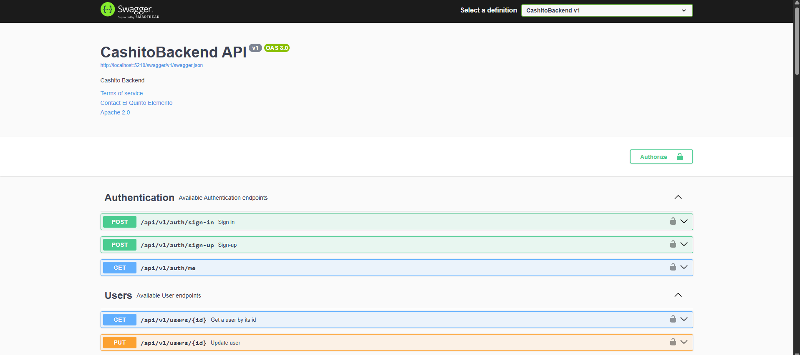
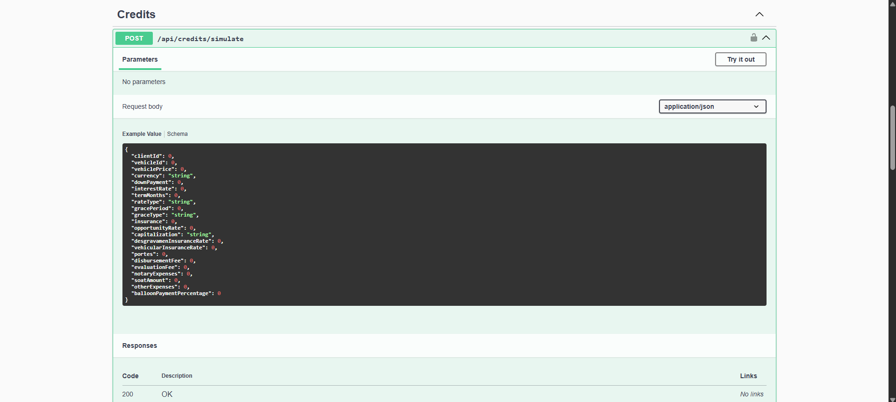
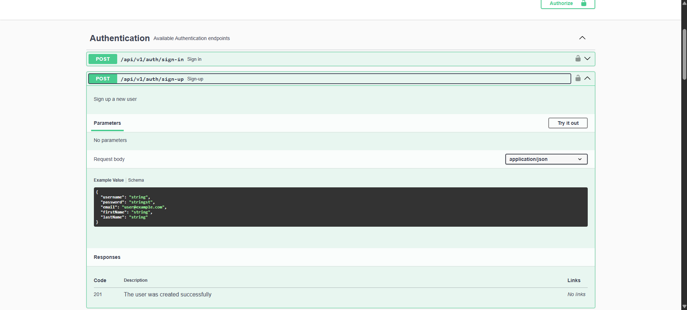

# Cashito API — El motor financiero detrás de Cashito

API REST de alto rendimiento para la gestión financiera y simulación de créditos vehiculares, construida bajo los principios de **Domain-Driven Design (DDD)** con **.NET 9** y **ASP.NET Core**.

---

## Descripción del sistema

**Cashito API** es el núcleo de Cashito, una plataforma especializada en la gestión financiera personal y corporativa, con un fuerte enfoque en el financiamiento y simulación de créditos automotrices bajo el **método de amortización francés**. 

El backend expone endpoints REST seguros y estructurados, organizados en torno a contextos delimitados (*Bounded Contexts*) que interactúan mediante servicios de dominio y fachadas anticorrupción (ACL).

### Módulos y Contextos Delimitados (Bounded Contexts)
- **Identity & Access Management (IAM):** Autenticación y autorización basada en tokens JWT. Soporta registro (`sign-up`), inicio de sesión (`sign-in`) y un sistema flexible de roles (`Admin` y `User`).
- **Clients:** Gestión completa del ciclo de vida de los clientes (asesorados), almacenando datos de contacto, perfiles financieros y auditoría de creación.
- **Vehicles:** Catálogo de vehículos disponibles para financiamiento, incluyendo atributos clave como precio, marca, modelo e información técnica relevante.
- **Credits:** El motor de cálculo del sistema. Permite simular y consolidar créditos vehiculares aplicando tasas nominales o efectivas (TEA/TNA), periodos de gracia (parciales/totales), seguros de desgravamen y vehiculares, portes, y gastos notariales. Genera automáticamente cronogramas en PDF y Excel, y gestiona el flujo de estados de cada crédito.
- **Notifications:** Canal de alertas internas y del sistema para notificar cambios de estados en créditos o hitos de pago.
- **Dashboard:** Generación de métricas de negocio en tiempo real (KPIs), como portafolio total financiado, clientes activos, créditos vigentes, tasa de morosidad, resúmenes de portafolio y accesos rápidos a registros recientes.

---

## Flujo del negocio (Autenticación y Créditos)

A continuación se muestra el flujo general desde el registro de un usuario hasta la simulación, aprobación y pago de un crédito:

```
[ Autenticación e Identidad ]
  ┌──────────────┐      POST /api/v1/auth/sign-up       ┌─────────────────┐
  │   Usuario    │ ───────────────────────────────────► │  Cashito API    │
  │ (Cliente/UI) │ ◄─────────────────────────────────── │  (Hash BCrypt)  │
  └──────────────┘           Respuesta HTTP 201         └─────────────────┘
         │
         │              POST /api/v1/auth/sign-in
         └────────────────────────────────────────────► ┌─────────────────┐
           ◄─────────── Retorna JWT Bearer Token ────── │ Autenticación   │
                                                        └─────────────────┘

[ Flujo del Crédito Vehicular (Protegido por Token Bearer) ]
  ┌──────────────┐     1. Registrar Cliente / Vehículo   ┌─────────────────┐
  │   Usuario    │ ───────────────────────────────────► │ DB MySQL        │
  │ Autenticado  │                                      └─────────────────┘
  └──────────────┘
         │
         │             2. POST /api/credits/simulate (Entrada de variables financieras)
         ├────────────────────────────────────────────► ┌─────────────────┐
         │                                              │ Motor de Simu-  │
         │ ◄─── Cronograma Francés, VAN, TIR, TCEA ──── │ lación (Memory) │
         │                                              └─────────────────┘
         │
         │             3. POST /api/credits (Consolidar en DB)
         ├────────────────────────────────────────────► ┌─────────────────┐
         │                                              │ Estado:         │
         │ ◄─── Genera PublicToken (GUID) y Crédito ─── │ 'Simulated'     │
         │                                              └─────────────────┘
         │
         │             4. PUT /api/credits/{id}/approve (Asesor o Vía Portal Público)
         ├────────────────────────────────────────────► ┌─────────────────┐
         │                                              │ Estado:         │
         │ ◄─── Notificación disparada al usuario ───── │ 'Approved'      │
         │                                              └─────────────────┘
         │
         │             5. PUT /api/credits/{id}/installments/{num}/pay (Primer Pago)
         └────────────────────────────────────────────► ┌─────────────────┐
           ◄─── Cambio automático de estado a Activo ─── │ Estado: 'Active'│
                                                        └─────────────────┘
                                                                 │
                                                ¿Todas las cuotas pagadas?
                                                                 ▼
                                                        ┌─────────────────┐
                                                        │ Estado:         │
                                                        │ 'Completed'     │
                                                        └─────────────────┘
```

---

## Tecnologías usadas

- **Runtime & Framework:** .NET 9.0 (ASP.NET Core Web API)
- **Acceso a Datos / ORM:** Entity Framework Core 9.0 (con MySQL Provider `MySql.EntityFrameworkCore`)
- **Base de Datos:** MySQL Server 8.0+
- **Seguridad y Criptografía:** JWT Bearer Authentication (`Microsoft.AspNetCore.Authentication.JwtBearer`), BCrypt.Net-Next para hashing de contraseñas.
- **Generación de Reportes:** ClosedXML (Exportación a Excel) y QuestPDF (Generación de cronogramas en PDF con licencia Community).
- **Documentación de API:** Swashbuckle (Swagger / OpenAPI 3.0) con soporte de anotaciones enriquecidas.
- **Internacionalización & Formateo:** Humanizer para el parseo de nombres y convenciones de API.

---

## Arquitectura

El backend implementa una **Arquitectura en Capas orientada a Bounded Contexts (DDD)**. La estructura del proyecto `CashitoBackend/` es la siguiente:

```
CashitoBackend/
├── Program.cs                          # Configuración del contenedor DI, middlewares y pipeline HTTP
├── appsettings.json                    # Parámetros de configuración (BD, JWT, SMTP)
├── Properties/
│   └── launchSettings.json             # Perfiles de ejecución local (puertos, entornos)
├── Shared/                             # Núcleo compartido (Kernel Común)
│   ├── Domain/                         # Excepciones, agregados auditables y eventos base
│   └── Infrastructure/                 # DbContext, Unit of Work y middlewares globales
│
├── [Bounded Contexts]/                 # Contextos Delimitados (IAM, Clients, Vehicles, Credits, Notifications, Dashboard)
│   ├── Domain/
│   │   ├── Model/
│   │   │   ├── Aggregates/             # Entidades Raíz del Agregado (ej. Credit, Client, Vehicle, User)
│   │   │   ├── Entities/               # Entidades internas (ej. Installment, Role)
│   │   │   ├── ValueObjects/           # Objetos de Valor (ej. Currency, GraceType, CreditStatus)
│   │   │   ├── Commands/               # Comandos CQRS para operaciones de escritura
│   │   │   └── Queries/                # Consultas CQRS para operaciones de lectura
│   │   ├── Repositories/               # Interfaces de repositorios de dominio
│   │   └── Services/                   # Interfaces de servicios de aplicación/dominio
│   ├── Application/
│   │   └── Internal/
│   │       ├── CommandServices/        # Lógica de comandos (escritura) e integraciones
│   │       ├── QueryServices/          # Lógica de queries (lectura)
│   │       └── OutboundServices/       # Servicios externos (Token JWT, Hashing, Envío de Correos)
│   ├── Infrastructure/
│   │   ├── Persistence/EFC/            # Repositorios concretos con EF Core
│   │   └── [Tech Services]/            # Adaptadores de infraestructura (QuestPDF, ClosedXML, MailKit)
│   └── Interfaces/
│       └── REST/                       # Controladores de la API, Resources (DTOs) y Assemblers (Mapeadores)
```

---

## Cómo ejecutar en local

### Requisitos previos
- **.NET 9.0 SDK** instalado.
- Servidor de base de datos **MySQL 8.0+** levantado y escuchando en el puerto `3306`.

### Pasos para iniciar la API:

1. **Clonar el repositorio backend:**
   ```bash
   git clone https://github.com/tuusuario/cashito-backend.git
   cd cashito-backend
   ```

2. **Crear base de datos local:**
   Ingrese a su cliente MySQL y ejecute:
   ```sql
   CREATE DATABASE cashito CHARACTER SET utf8mb4 COLLATE utf8mb4_unicode_ci;
   ```

3. **Configurar las credenciales en `CashitoBackend/appsettings.json`:**
   Edite el archivo y reemplace los valores con sus accesos locales (use placeholders si planea subir este archivo al repositorio):
   ```json
   {
     "TokenSettings": {
       "Secret": "TU_JWT_SECRET_KEY_CON_MINIMO_32_CARACTERES_AQUI"
     },
     "ConnectionStrings": {
       "DefaultConnection": "server=localhost;port=3306;database=cashito;user=TU_USUARIO;password=TU_PASSWORD"
     },
     "EmailSettings": {
       "SenderName": "Cashito Support",
       "SenderEmail": "tu-email-smtp@gmail.com",
       "Password": "tu-clave-aplicacion-smtp",
       "SmtpServer": "smtp.gmail.com",
       "Port": 587
     }
   }
   ```

4. **Restaurar dependencias y levantar el servidor:**
   Ejecute los siguientes comandos en la raíz del proyecto backend (`CashitoBackend/`):
   ```bash
   dotnet restore
   dotnet run
   ```
   *Nota: La base de datos y sus tablas se crearán automáticamente al primer arranque gracias al disparador `db.Database.EnsureCreated()` en el arranque del `Program.cs`.*

5. **Puertos y URLs por defecto:**
   La aplicación se configurará en los siguientes puertos locales definidos en `launchSettings.json`:
   - **HTTP:** `http://localhost:5210`
   - **HTTPS:** `https://localhost:7115`
   - **Swagger UI:** `http://localhost:5210/swagger` o `https://localhost:7115/swagger`

---

## Endpoints principales

### 🔐 Autenticación (`/api/v1/auth`)
```http
POST /api/v1/auth/sign-up         // Registrar un nuevo usuario (Rol 'User' por defecto)
POST /api/v1/auth/sign-in         // Iniciar sesión. Retorna el token Bearer JWT
GET  /api/v1/auth/me              // Obtener información del usuario autenticado actual (Requiere Token)
```

### 👤 Usuarios (`/api/v1/users`)
```http
GET  /api/v1/users                // Listar todos los usuarios del sistema (Requiere Token)
GET  /api/v1/users/{id}           // Obtener usuario por ID (Requiere Token)
PUT  /api/v1/users/{id}           // Actualizar información básica del usuario (Requiere Token y Coincidencia de ID)
POST /api/v1/users/{id}/change-password // Cambiar contraseña de un usuario validando la actual (Requiere Token)
```

### 👥 Clientes (`/api/clients`)
```http
GET  /api/clients                 // Listar clientes asignados al usuario autenticado (Requiere Token)
GET  /api/clients/{id}            // Detalle de un cliente específico por ID (Requiere Token)
POST /api/clients                 // Crear un nuevo cliente asesorado (Requiere Token)
PUT  /api/clients/{id}            // Actualizar datos del cliente (Requiere Token)
DELETE /api/clients/{id}          // Eliminar un cliente (Requiere Token)
```

### 🚗 Vehículos (`/api/vehicles`)
```http
GET  /api/vehicles                // Listar catálogo de vehículos del usuario (Requiere Token)
GET  /api/vehicles/{id}           // Obtener detalles de un vehículo por ID (Requiere Token)
POST /api/vehicles                // Añadir un vehículo al catálogo (Requiere Token)
PUT  /api/vehicles/{id}           // Actualizar información del vehículo (Requiere Token)
DELETE /api/vehicles/{id}         // Eliminar un vehículo del catálogo (Requiere Token)
```

### 💳 Créditos y Simulación (`/api/credits`)
```http
POST /api/credits/simulate        // Simular cronograma en memoria sin guardar en base de datos (Requiere Token)
POST /api/credits                 // Consolidar y guardar un crédito en estado 'Simulated' (Requiere Token)
GET  /api/credits                 // Listar todos los créditos del usuario autenticado (Requiere Token)
GET  /api/credits/{id}            // Detalle de un crédito específico (Requiere Token)
GET  /api/credits/{id}/schedule   // Obtener cronograma detallado de cuotas (Requiere Token)
GET  /api/credits/{id}/pdf        // Descargar cronograma de cuotas en formato PDF (Requiere Token)
GET  /api/credits/{id}/excel      // Descargar cronograma de cuotas en formato Excel (Requiere Token)
PUT  /api/credits/{id}/approve    // Aprobar el crédito (Estado -> Approved. Requiere Token)
PUT  /api/credits/{id}/activate   // Activar el crédito directamente (Estado -> Active. Requiere Token)
PUT  /api/credits/{id}/reject     // Rechazar el crédito (Estado -> Rejected. Requiere Token)
PUT  /api/credits/{id}/complete   // Completar la amortización del crédito (Estado -> Completed. Requiere Token)
PUT  /api/credits/{id}/installments/{number}/pay // Registrar el pago de una cuota de crédito (Requiere Token)
```

### 🌐 Portal Público de Créditos (`/api/public/credits` - Acceso Anónimo con Token Público)
```http
GET  /api/public/credits/{id}?token={token}                 // Obtener crédito públicamente
GET  /api/public/credits/{id}/schedule?token={token}        // Obtener cronograma de forma pública
GET  /api/public/credits/{id}/pdf?token={token}             // Descargar PDF públicamente sin autenticación previa
GET  /api/public/credits/{id}/excel?token={token}           // Descargar Excel públicamente sin autenticación previa
PUT  /api/public/credits/{id}/installments/{number}/pay?token={token} // Pagar una cuota públicamente
PUT  /api/public/credits/{id}/approve?token={token}          // Aprobar crédito vía enlace público
PUT  /api/public/credits/{id}/reject?token={token}           // Rechazar crédito vía enlace público
```

### 🔔 Notificaciones (`/api/notifications`)
```http
GET  /api/notifications           // Listar notificaciones del usuario autenticado (Requiere Token)
GET  /api/notifications/unread-count // Obtener número de alertas no leídas (Requiere Token)
PUT  /api/notifications/{id}/read // Marcar una alerta como leída (Requiere Token)
PUT  /api/notifications/read-all  // Marcar todas las notificaciones como leídas (Requiere Token)
```

### 📊 Dashboard (`/api/dashboard`)
```http
GET  /api/dashboard/kpis          // Obtener indicadores financieros del portafolio (Monto, Clientes, Mora, etc.)
GET  /api/dashboard/recent-clients // Listar los últimos 5 clientes registrados (Requiere Token)
GET  /api/dashboard/vehicles      // Listar los últimos 5 vehículos agregados (Requiere Token)
GET  /api/dashboard/portfolio-summary // Obtener desglose de portafolio global (Requiere Token)
```

---

## Reglas de negocio importantes (Motor Financiero)

- **Cálculo de Tasa Mensual:**
  - Si la tasa de interés provista es **TEA (Tasa Efectiva Anual)**, se calcula la mensual usando la equivalencia temporal de interés compuesto:
    $$i_{mensual} = (1 + TEA)^{1/12} - 1$$
  - Si es **TNA (Tasa Nominal Anual)**, se requiere el período de capitalización (diario, mensual, bimestral, trimestral, semestral, anual) para hallar la tasa mensual efectiva equivalente:
    $$i_{mensual} = \left(1 + \frac{TNA}{m}\right)^{m/12} - 1$$ *(donde $m$ es la frecuencia de capitalización al año).*
- **Cuota Balón (Balloon Payment):**
  - Es obligatorio en el sistema y debe representar estrictamente **entre el 40% y el 50%** del valor del vehículo. Se añade al saldo final de la última cuota (`isBalloon = true`).
  - La cantidad amortizable a lo largo del plazo regular se reduce:
    $$\text{Capital a Amortizar} = \text{Monto Financiado} - \text{Monto Cuota Balón}$$
- **Períodos de Gracia:**
  - **Gracia Total:** No se paga amortización ni intereses. Los intereses generados en dicho período se capitalizan en el saldo deudor de la cuota base ($Saldo + Inter\acute{e}s$). Además, los cargos fijos e impuestos no se facturan en estos meses de gracia.
  - **Gracia Parcial:** No se amortiza capital, pero se pagan mensualmente los intereses y los cargos correspondientes (seguros de desgravamen/vehicular, portes, etc.) sin capitalizar.
- **Cuota Base (Fórmula Francesa):**
  - Las cuotas en el período de pago ordinario se calculan bajo cuota constante:
    $$CuotaBase = SaldoDeudor \times \frac{i_{mensual} \times (1 + i_{mensual})^n}{(1 + i_{mensual})^n - 1}$$ *(donde $n$ es la cantidad de meses hábiles de pago, excluyendo el período de gracia).*
- **Comisiones y Seguros:**
  - El seguro de desgravamen se cobra sobre el saldo deudor al inicio del período.
  - El seguro vehicular se calcula de forma fija mensual sobre el precio de venta total del vehículo.
  - Los gastos notariales, SOAT, comisión de evaluación y comisión de desembolso actúan como gastos iniciales que reducen el desembolso neto inicial a nivel de flujos para el cálculo de indicadores financieros.
- **VAN, TIR y TCEA:**
  - El flujo cero ($FC_0$) para indicadores equivale a: $\text{Capital Amortizable} - \text{Gastos Notariales} - \text{SOAT} - \text{Comisión Desembolso} - \text{Comisión Evaluación}$.
  - Los flujos mensuales de salida corresponden al pago de cada cuota regular (excluyendo el monto balón del flujo interno, el cual se computa en el momento final).
  - La **TIR** se calcula iterativamente usando el método numérico de Newton-Raphson o bisección. La **TCEA** anual final se obtiene proyectando la TIR mensual: $\text{TCEA} = (1 + TIR)^{12} - 1$.
- **Transiciones de Estado de Crédito:**
  - Un crédito recién registrado empieza como `Simulated`.
  - Puede transicionar a `Approved` o `Rejected`.
  - Pasa a `Active` al registrar el primer pago exitoso de cualquiera de sus cuotas.
  - Pasa a `Completed` únicamente cuando el 100% de las cuotas del cronograma han sido pagadas.

---

## Capturas de pantalla

### Swagger — Documentación general


### Swagger — Módulo de Créditos y Simulación


### Swagger — Autenticación y IAM


---

## Proyecto relacionado

- [Cashito Frontend](https://github.com/tuusuario/cashito-frontend) — Interfaz SPA de alta fidelidad construida en Angular 19 que consume esta API REST.

---

## Autor

**Victor Andres Cruz Ibarra** | **andrestheb@gmail.com** | **+51 960 938 630**

*Cashito API — Backend estructurado, confiable y seguro para el financiamiento inteligente de vehículos.*
